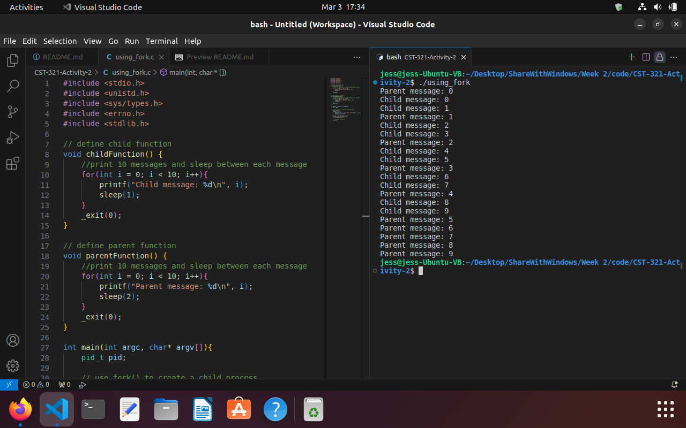
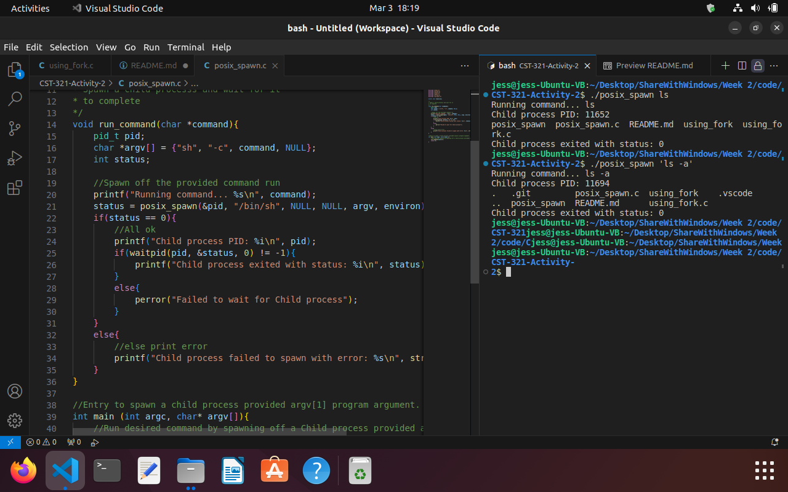
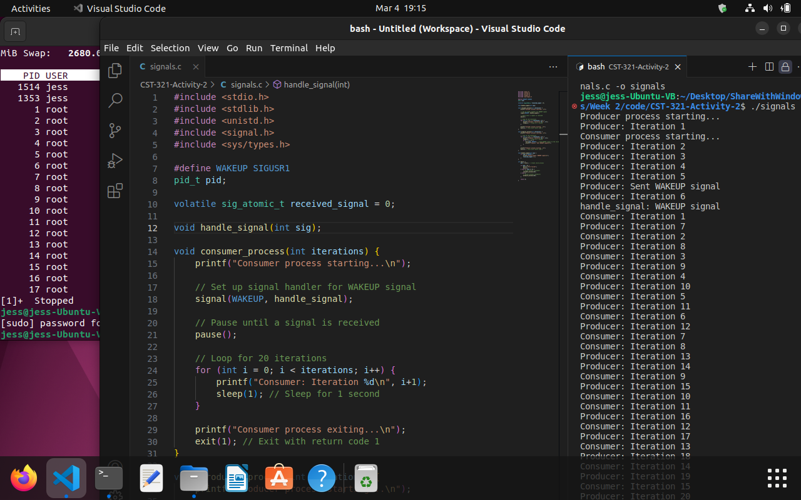
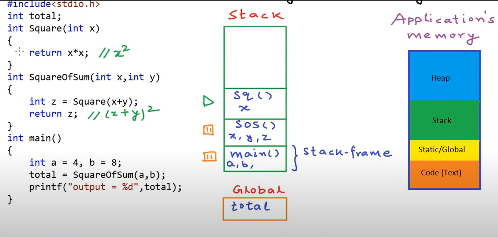
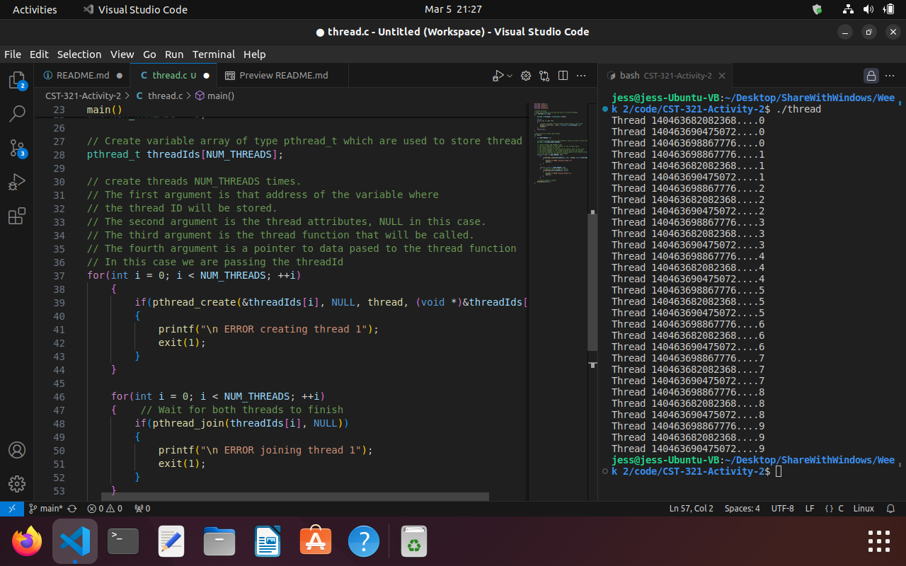
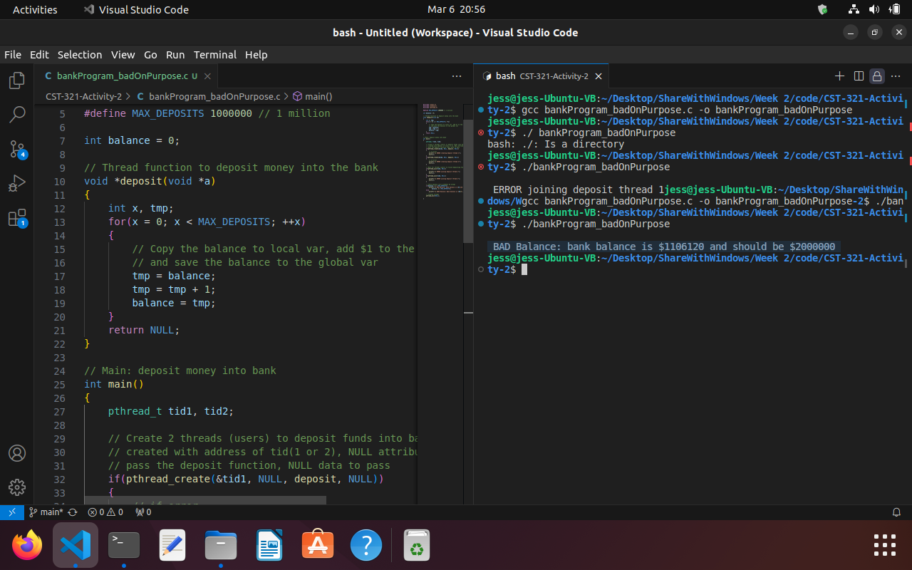
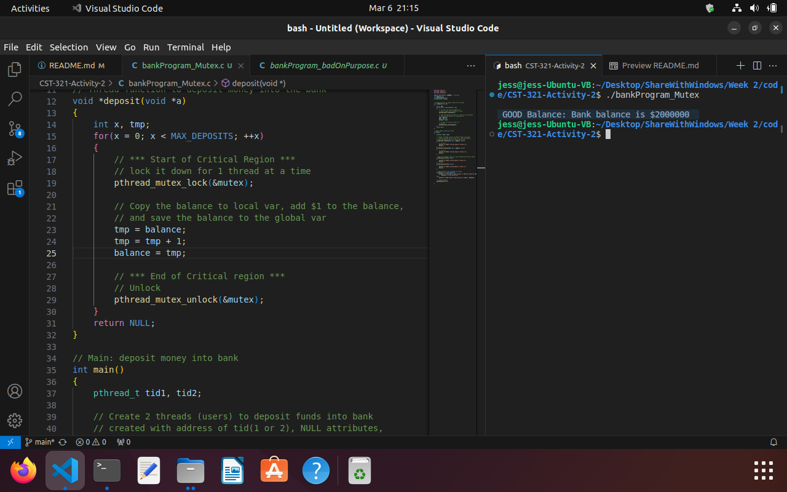

# CST-321-Activity-2

## Processes in Linux

#### Using the Linux fork()

This [first program](./using_fork.c) uses the fork()  function to create a duplicate process. The main function calls the fork() function for the pid_t data type which creates 2 identical processes. The difference between them is the process ID. The child has an Id of 0 and the parent is some larger number. The if statement filters the process into the parentFunction or childFunction based on their pid number.


#### Using posix_spawn() functions

This next program focuses on using [posix_spawn](./posix_spawn.c) to spawn a child process which then calls a shell command by passing the argument to '/bin/sh'. The waitpid() function tells the parent process to wait for the child to complete before completing it's own process.
According to the Linux manual, posix_spawn takes several aguments:
int posix_spawn(pid_t *pid,
const char *path,
const posix_spawn_file_actions_t *file_actions,
const posix_spawnattr_t *attrp,
char *const argv[],
char *const envp[]);

More specifically in my program here are the aguments:

- pid: a pointer to a variable where the PID of the spawned process will be stored.
- path: the path to the shell executable.
- file_actions: actions to perform on the file descriptors in the child process (NULL in this case).
- attrp: process attributes. Resource limits could be specified here. (NULL in this case).
- argv: argument vector. The first argument is typically the path to the executable, then the commands to be executed. the last element must be NULL to indicate the end of the argument list.
- envp: environment variables (NULL in this case).



## Signals in Linux

This next program, [signals](./signals.c), uses fork() in the main function to create a child process, then calls their respective functions based on the pid to determine if they are the parent or child. The parent becomes a producer of a signal and the child becomes the consumer. Both functions begin at relatively the same time, but the consumer function uses the pause() function to sit idle. When the producer reaches the 5th iteration in the loop, it uses the kill(pid, WAKEUP) function to send out a WAKEUP signal to the pid. If the pid is 0, the consumer_process will use the handle_signal function which sets the received_signal flag to 1, indicating that the wakeup signal has been received. When the consumer receives that signal, the operating system interrupts the execution of the pause() function and then continues.


## Threads in Linux using POSIX thread functions

#### But first, pointers are variables that store the address of another variable

Using \* in front of the variable declares it as pointer. In other words, it uses the value that is stored in that address. Using & is the address-of operator and gets the address of a variable.

Examples:

```
int a; // let's say memory address is 204
int *p = &a; // declares a pointer variable that can hold the memory address of an integer and tells p to point to the address of a: 204
a = 5;
print p // prints 204
print &a // prints 204
print &p // prints 64
print *p // prints 5, the value that is stored at the address
*p = 8 // changes the value at the address where p is pointing
print a // 8 because p was pointing to a's address and changed it
```

#### But also first (2nd): stack vs heap
There are 4 different segments of memory at the application's disposal.  
1. Code: holds the text instructions.  
2. Static/Global: holds the global variables (not declared inside a function) that are held during the entire life of the application and are accessible anywhere.
3. Stack: holds the function calls and local variables.  They are pushed onto the stack and then are popped off when they are finished being used.

Thanks to: <https://www.youtube.com/watch?v=_8-ht2AKyH4&ab_channel=mycodeschool>


4. Heap: the only segment that can grow while the application is running. It is a dynamic free store of memory.  The only way to access the heap is by using pointers.  In C, 4 functions are used: 
    - malloc: used to allocate an amount of memory in the heap. 
    - free

    Usage: 
    ```
    // allocate enough space for 1 int
    int *p = (int*)malloc(sizeof(int)); 

    free(p); // deallocate when not needed so that it isn't taking up memory

    // allocate enough space for an array of 20 ints
    int *p = (int*)malloc(20*sizeof(int));

    free(p);
    ```
    - calloc
    - realloc

#### And another thing: pthreads
From the manual: 
``` 
int pthread_create(pthread_t *thread, 
                    const pthread_attr_t *attr,
                    void *(*start_routine) (void *), 
                    void *arg);
```
The ```void *(*start_routine) (void *)``` part is a pointer to a function and is where we start the function from.  It returns a 'void *' and it accepts a 'void *' which basically means that it is a pointer to anything.

### Now to our next program
The [thread progam](./thread.c) shows how we can use the pthread_create() to create threads and pthread_join() to wait for each thread to exit before exiting the main program.  I used 1 pthread_create() function that will create new threads and take in 4 arguments:
1. Address location to store the id as its first argument.
2. Attributes for the new thread like detached state, stack size, or schedule priority (NULL in this case).
3. Function that the new thread will execute. thread() is the function in my case that simply prints out a message with the thread ID.
4. Pointer to data that will be passed to the thread function. In this case, it is the thread ID

Then the thread() function receives the thread ID as an argument and extracts it to print to the console.


## Mutex and Semaphore
### Bad Bank Program
Our first program shows how not to ask multiple threads to manipulate a single shared int 1 million times each.  This is by using a bad bank program where 2 threads go and add $1 a million times to a shared balance.  The problem is, when 1 of them is using the balance, the other one doesn't wait their turn and they end up adding to the same version of balance at times.  Meaning they both might think the balance is $10 and they both add $1 at the same time, then they both declare that the balance is $11 even though 10 + 1 + 1 should be 12.  

The total balance at the end should be $2 million, but it ends up being much less.


### Working Bank Program using Mutexes
Now we added the mutex to lock down the critical area of the deposit() function.  Now only 1 thread is allowed to access the critical area at a time:
```
// *** Start of Critical Region ***
        // lock it down for 1 thread at a time
        pthread_mutex_lock(&mutex);

        // Copy the balance to local var, add $1 to the balance,
        // and save the balance to the global var
        tmp = balance;
        tmp = tmp + 1;
        balance = tmp;

        // *** End of Critical region ***
        // Unlock
        pthread_mutex_unlock(&mutex);
```
And we get the correct balance at the end.


### Working Bank Program using Semaphores
Now we used a semaphore in a similar way by locking down the area of the code that manipulates the balance.  We initially only give 1 thread access at a time, so basically we are using the semaphore as a mutex when we add the '1' as the last argument of this: ```semaphore = sem_open("Semaphore", O_CREAT, 00644, 1);```

Then, this is the part that locks down the critical area.

```
// *** Start of Critical Region ***
        // lock it down for 1 thread at a time
        sem_wait(semaphore);

        // Copy the balance to local var, add $1 to the balance,
        // and save the balance to the global var
        tmp = balance;
        tmp = tmp + 1;
        balance = tmp;

        // *** End of Critical region ***
        // Unlock
        sem_post(semaphore);
```
